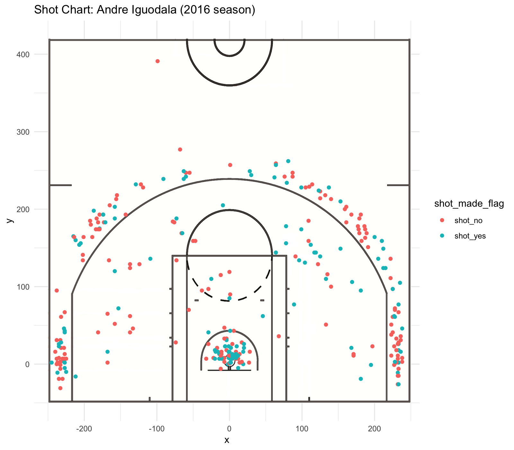
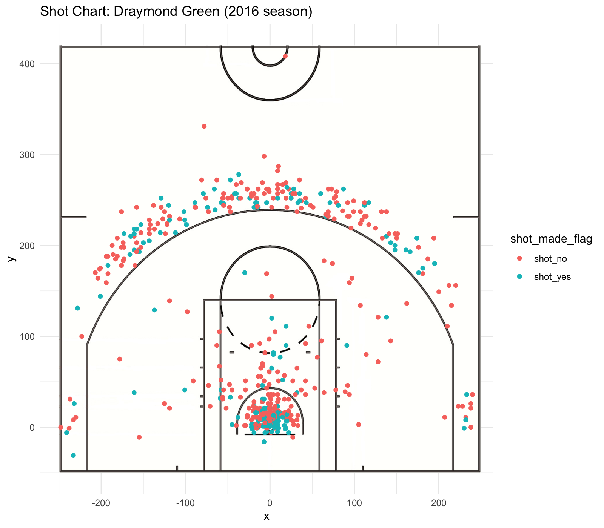
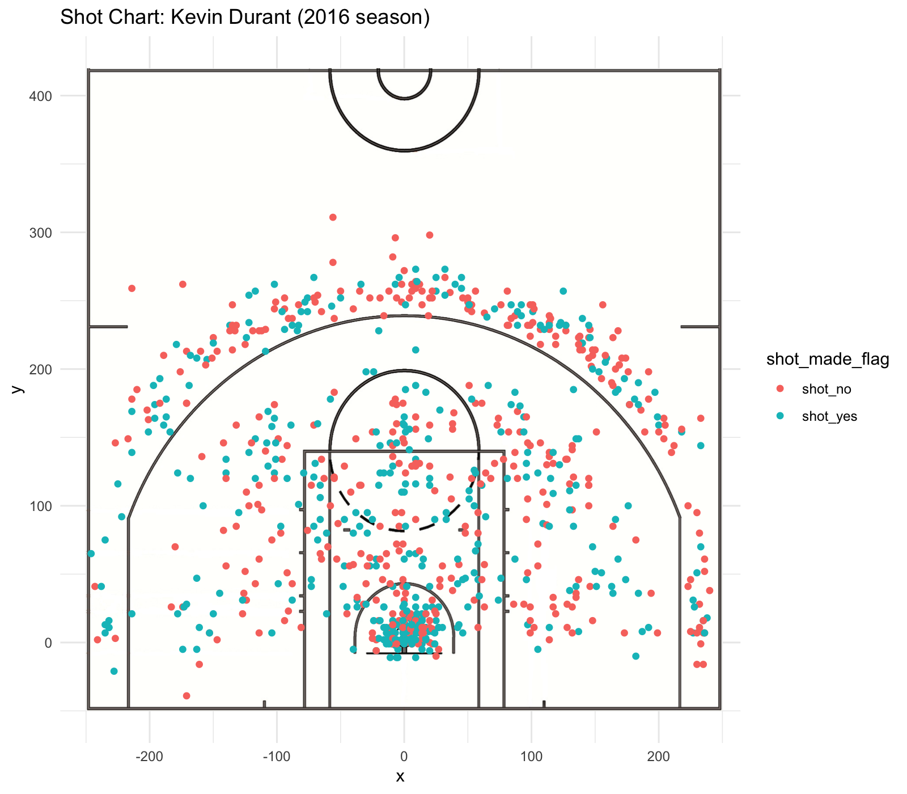
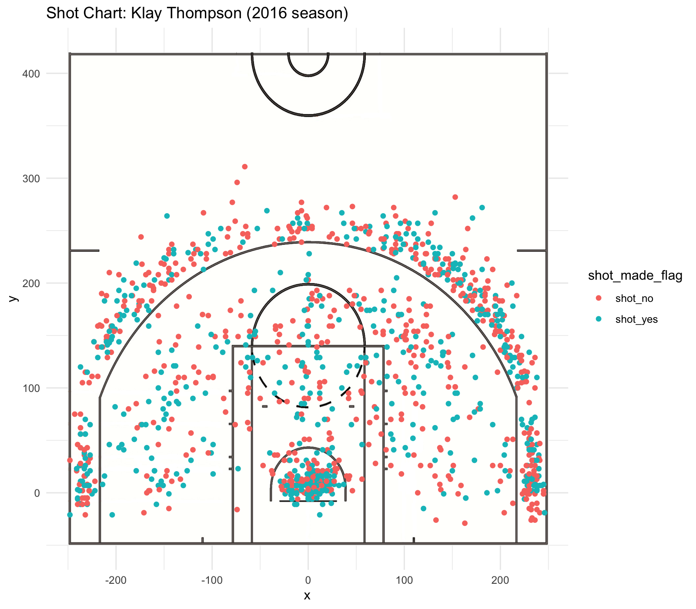
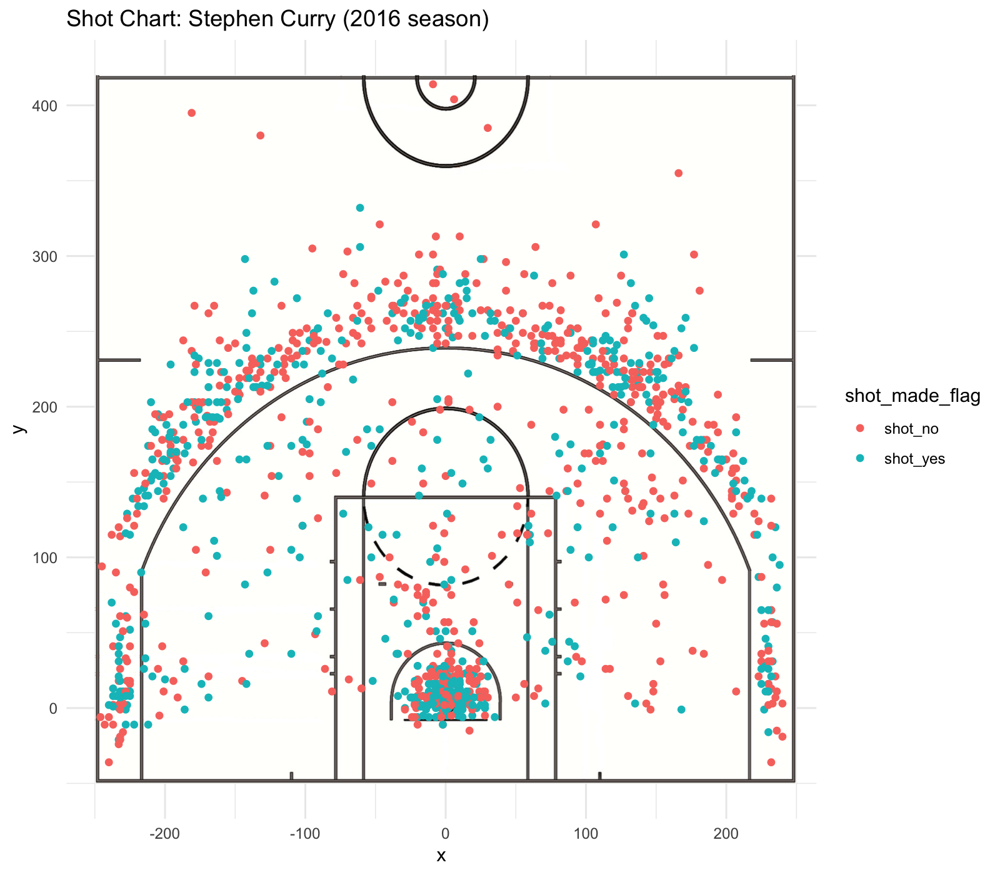
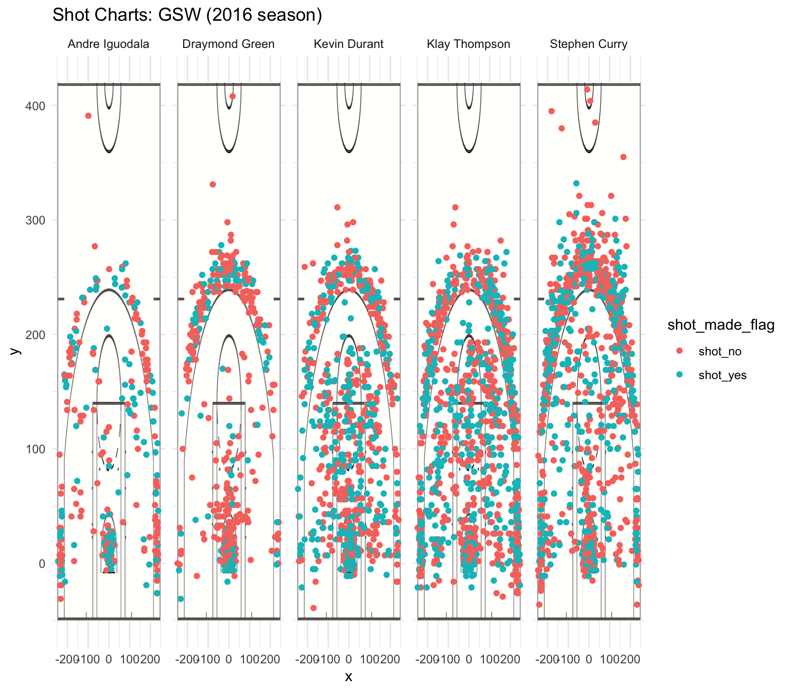

```{r setup, include=FALSE}
knitr::opts_chunk$set(echo = TRUE)
```

```{r shooting tables, include = FALSE}
library(readr)
library(dplyr)

all_data <- read.csv("../data/shots-data.csv")
all_data <- select(all_data, -X)

shot_data <- select(all_data, name, shot_made_flag, shot_type)

shot_2pt <- arrange(
  summarise(
  group_by(
    filter(shot_data, shot_type == "2PT Field Goal"),
    name),
  total = sum(shot_made_flag == "shot_yes" | shot_made_flag == "shot_no"), made = sum(shot_made_flag == "shot_yes"), perc_made = made / total), 
  desc(perc_made))

shot_3pt <- arrange(
  summarise(
  group_by(
    filter(shot_data, shot_type == "3PT Field Goal"),
    name),
  total = sum(shot_made_flag == "shot_yes" | shot_made_flag == "shot_no"), made = sum(shot_made_flag == "shot_yes"), perc_made = made / total), 
  desc(perc_made))

shot_perc <- arrange(
  summarise(
  group_by(shot_data, name), 
  total = sum(shot_made_flag == "shot_yes" | shot_made_flag == "shot_no"), made = sum(shot_made_flag == "shot_yes"), perc_made = made / total), 
  desc(perc_made))
```

# Introduction
The Golden State Warriors are a professional American basketball team based in the San Francisco Bay Area. They currently hold several NBA records and in the past decade in particular, they have experienced a lot of success, much of which can be attributed to some of their star players whose shot statistics will be the focus of our analysis here.

We will be specifically looking at the players Andre Iguodala, Draymond Green, Kevin Durant, Klay Thompson, and Stephen Curry and the data of their shots from the 2016 season.

## Basketball Positions

### Point guard
+ responsible for directing plays
+ lead team in assists
+ play-maker

### Shooting guard
+ usually prolific from three-point range

### Small forward
+ usually good long range shooters
+ most versatile position

### Power forward
+ often most versatile scorer (in terms of distance from basket)

### Center
+ usually plays near baseline or close to basket

\ 

# Players

## Andre Iguodala
+ Shooting guard/Small forward

```{r iguodala chart, out.width = "80%", echo = FALSE, fig.align = "center"}

```

## Draymond Green
+ Power forward

```{r green chart, out.width = "80%", echo = FALSE, fig.align = "center"}

```

## Kevin Durant
+ Small forward

```{r durant chart, out.width = "80%", echo = FALSE, fig.align = "center"}

```

## Klay Thompson
+ Shooting guard

### Records
+ NBA regular season record for most points scored in a quarter (37)
+ NBA regular season record for most three-pointers made in a game (14)
+ NBA record for most three-pointers made in a single playoffs (98 tied with Stephen Curry)
+ NBA playoff record for most three-pointers made in a game (11)

```{r thompson chart, out.width = "80%", echo = FALSE, fig.align = "center"}

```

## Stephen Curry
+ Point guard

### Records
+ NBA regular season record for made three-pointers (402)
+ NBA record for most three-pointers made in a single playoffs (98 - tied with Klay Thompson)
+ NBA Finals record for most three-pointers made in a game (9)
+ NBA record for most consecutive regular season games with a made three-pointer (157)
+ NBA record for most consecutive playoff games with a made three-pointer (90)
+ NBA record for most points scored in an overtime period (17)
+ Warriors franchise leader in three-point field goals made

```{r curry chart, out.width = "80%", echo = FALSE, fig.align = "center"}

```

\ 

# Comparing the Players' Effective Shooting Percentage
## Two-pointer statistics
```{r two pointer, echo = FALSE}
shot_2pt
```

## Three-pointer statistics
```{r three pointer, echo = FALSE}
shot_3pt
```

## Overall statistics
```{r overall, echo = FALSE}
shot_perc
```

## Comparing player shot charts
```{r out.width = "80%", echo = FALSE, fig.align = "center"}

```

# Summary
Unsurprisingly, Thompson and Curry, both of whom hold records for their three-pointers, have the greatest consistency when it comes to making their three-pointer shots. However, in terms of both their two-pointer shots and just their overall percentage for the shots that they make, their statistics don't compare quite as well to the rest of the players.

That being said, a closer inspection of the data makes it clear that their success doesn't like inherently in any sort of godlike consistency, but rather, as the incredible density of points on their shot charts suggests, they simply take way more shots than some of their other teammates and as a result, the number of shots they make--and in turn the amount of points they score--is also much greater.
